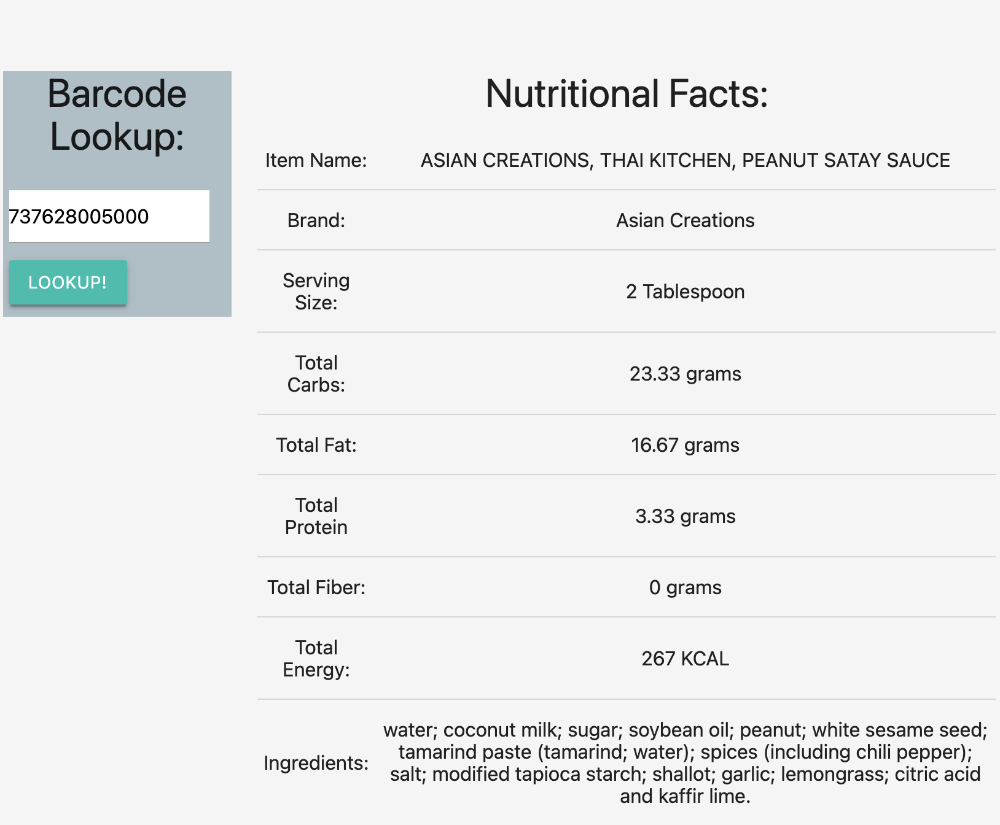

# Project 1: What's In Your Kitchen?

## Whats in your pantry? 

Are you tired of trying to figure what's for dinner every night? 

Let our app help you out !!!

[Your Pantry](https://kammielatay.github.io/Your-Pantry/)

Everyone has random things in their pantry or freezer. We all have busy lives and run out of ideas for what to make. Enter in your items and our site will generate a list of possible recipes to make. From breakfast, to lunch, and to dinner.

## How to use: 
There are two possible ways that you can use our application: 

1) Simply click the "Start Here" button. Once you have started, a list of checkboxes will appear. Check the items that you have on hand and click "Get Recipe!" and a list of possible meals will appear. If you click on the red button, it will add the recipe card to your favorites. If you click on the recipe card, it will take you to the recipe page so that you can start cooking. 

or

2)Say you have something in your kitchen and want to get the more information nutritional information about the product. Simply input the barcode and a table will appear with nutritional facts, such as serving size, carb, fat, protein content, etc. 

However you choose to use our application, it will surely not disappoint. 

### Click the My Favorite Recipes for your own list
You can check your history for amazing recipes you have tried before and love. 
Create your entire recipe box in one location. 

